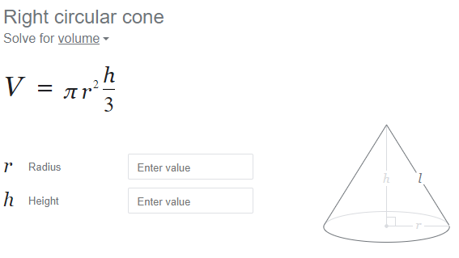
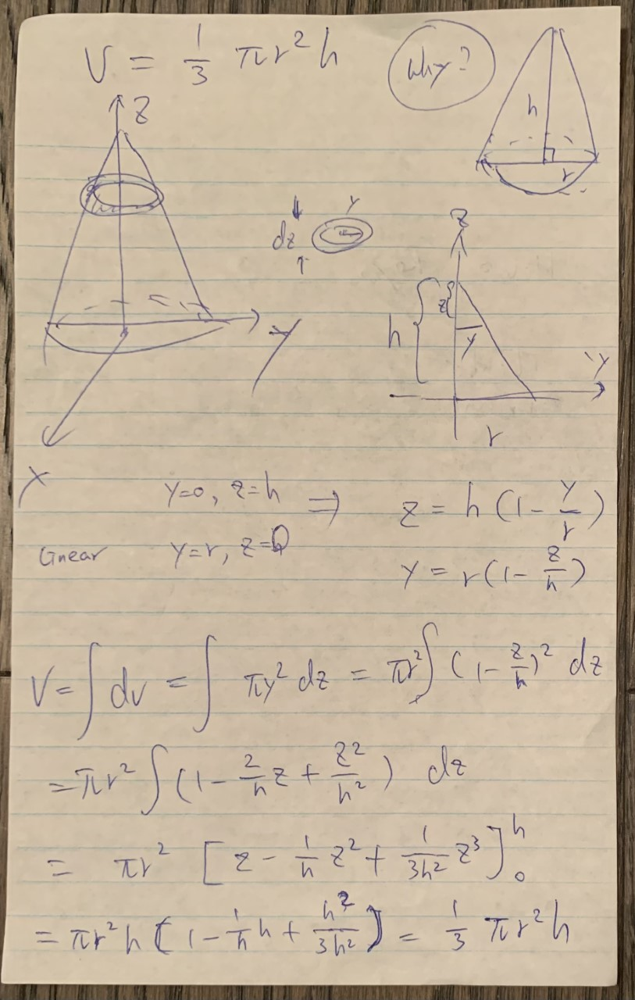
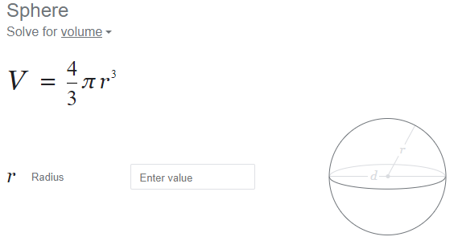
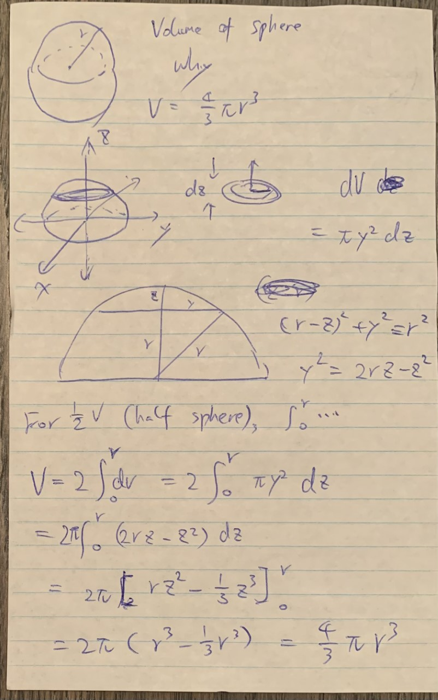
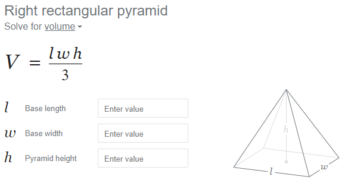

# MyCalculus

My Calculus

# The volume of a right circular Cone

$$
V = \frac{1}{3} \pi r^2 h
$$

# The volume of a Sphere

$$
V = \frac{4}{3} \pi r^3
$$

# The volume of a right rectangular Pyramid

$$
V = \frac{1}{3} l w h
$$

